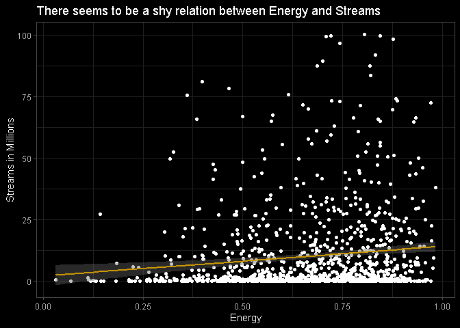
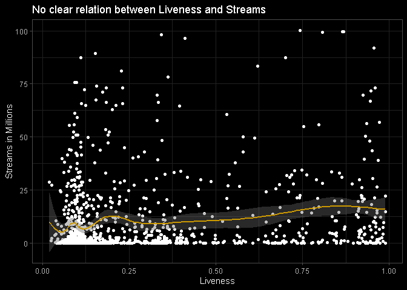

# Análise das paradas musicais Top 200 do Spotify para o mercado brasileiro
# Parte 3 - Spotify Subjective Analysis

## Análise de características subjetivas

Nesta seção, é feita uma curta análise das características subjetivas
das músicas presentes no Top 200 do Spotify Brasil. A maior parte das
features analisadas não se mostrou relevante como variável dependente
para explicar o número de streams. Dito isso, é possível ver uma leve
relação entre Energia e número de streams. Também é possível conferir a
classificação das músicas por feature com as funções head() e tail().

### Energia

Esta foi a principal feature se tratando de poder de explicação do
número de streams. As músicas mais “energéticas” são do gênero funk
brasileiro e as menos são um gênero específico de pop internacional.

<details>

<summary>Ver código</summary>

<p>

``` r
# Function to specify decimals
specify_decimal <- function(x, k) trimws(format(round(x, k), nsmall=k))

energy <- df %>%
  group_by(uri, track_name.x) %>%
  summarise(Artist=unique(artist_name),
            Energy=unique(energy),
            Total_Streams_Millions= sum(streams)/1000000) %>%
  arrange(desc(Energy))

energy <- energy[,2:5]
pl <- ggplot(energy, aes(y=Total_Streams_Millions, x=Energy)) +
  geom_point() + dark_theme_light() +geom_smooth() +
  labs(x="Energy", y='Streams in Millions', title="There seems to be a shy relation between Energy and Streams")
```

    ## Inverted geom defaults of fill and color/colour.
    ## To change them back, use invert_geom_defaults().

``` r
# Adjusting column and format
energy$Total_Streams_Millions <- specify_decimal(energy$Total_Streams_Millions,2)
colnames(energy)[1] <- 'Track_Name'
```

</p>

</details>

``` r
head(energy, 10)
```

    ## # A tibble: 10 x 4
    ##    Track_Name                       Artist           Energy Total_Streams_Millions
    ##    <fct>                            <fct>             <dbl> <chr>                 
    ##  1 Sapequinha                       Lexa              0.984 38.05                 
    ##  2 Finalidade Era Ficar em Casa     MC Kevin o Chris  0.978 9.65                  
    ##  3 MIL GRAU                         Gloria Groove     0.977 5.37                  
    ##  4 Favela chegou - Ao vivo          Ludmilla          0.973 16.39                 
    ##  5 Coisa Boa                        Gloria Groove     0.973 22.43                 
    ##  6 Baila Conmigo (feat. Kelly Ruiz) Dayvi             0.972 0.11                  
    ##  7 Vamos pra Gaiola                 MC Kevin o Chris  0.971 72.31                 
    ##  8 My Girl                          Vintage Culture   0.963 0.59                  
    ##  9 Quem Traiu Levou - Ao Vivo       Gusttavo Lima     0.958 7.61                  
    ## 10 Quem Traiu Levou - Ao Vivo       Gusttavo Lima     0.958 25.01

``` r
tail(energy, 10)
```

    ## # A tibble: 10 x 4
    ##    Track_Name                                                            Artist        Energy Total_Streams_Millions
    ##    <fct>                                                                 <fct>          <dbl> <chr>                 
    ##  1 hope is a dangerous thing for a woman like me to have - but I have it Lana Del Rey  0.144  0.07                  
    ##  2 Dois Corações                                                         Melim         0.142  27.16                 
    ##  3 Forward (feat. James Blake)                                           Beyoncé       0.133  0.08                  
    ##  4 JACKBOYS                                                              JACKBOYS      0.13   0.10                  
    ##  5 xanny                                                                 Billie Eilish 0.125  0.39                  
    ##  6 :( (Nota De Voz 8)                                                    Jão           0.118  0.12                  
    ##  7 A Vida Nunca Cansa                                                    Tiago Iorc    0.114  0.71                  
    ##  8 when the party's over                                                 Billie Eilish 0.111  1.53                  
    ##  9 Love song                                                             Lana Del Rey  0.0694 0.11                  
    ## 10 Sei                                                                   Tiago Iorc    0.0307 0.65

``` r
pl
```

    ## `geom_smooth()` using method = 'gam' and formula 'y ~ s(x, bs = "cs")'

<!-- -->

### Dançabilidade

A dançabilidade não se mostrou tão relevante na explicação das streams.
É uma feature que segue a mesma tendência do fator Energia, com funk
brasileiro e pop internacional nas pontas.

<details>

<summary>Ver código</summary>

<p>

``` r
# Dançabilidade
dance <- df %>%
  group_by(uri, track_name.x) %>%
  summarise(Artist=unique(artist_name),
            Danceability=unique(danceability),
            Total_Streams_Millions= sum(streams)/1000000) %>%
  arrange(desc(Danceability))

dance <- dance[,2:5]
pl <- ggplot(dance, aes(y=Total_Streams_Millions, x=Danceability)) +
  geom_point() + dark_theme_light() +geom_smooth() +
  labs(x="Danceability", y='Streams in Millions', title="No meaningful relation between Daceability and Streams")

# Adjusting column and format
dance$Total_Streams_Millions <- specify_decimal(dance$Total_Streams_Millions,2)
colnames(dance)[1] <- 'Track_Name'
```

</p>

</details>

``` r
head(dance,10)
```

    ## # A tibble: 10 x 4
    ##    Track_Name             Artist                Danceability Total_Streams_Millions
    ##    <fct>                  <fct>                        <dbl> <chr>                 
    ##  1 Vou Falar Pra Tu       Jerry Smith                  0.964 0.34                  
    ##  2 Eu Já Catuquei         Dj Henrique de Ferraz        0.957 0.35                  
    ##  3 Ritmo do Pam Pam       MC Rafa 22                   0.956 0.08                  
    ##  4 O Pai Tá Livre         Jerry Smith                  0.954 1.88                  
    ##  5 Chacoalhando           Mc Leléto                    0.95  1.78                  
    ##  6 Garupa 2               Mc Nando                     0.947 6.22                  
    ##  7 Garupa, Pt. 2          Dj Henrique de Ferraz        0.947 15.71                 
    ##  8 Te Amo Sem Compromisso MC Doni                      0.94  33.87                 
    ##  9 my strange addiction   Billie Eilish                0.939 0.08                  
    ## 10 Rabetão no Chão        Mc Th                        0.936 3.15

``` r
tail(dance,10)
```

    ## # A tibble: 10 x 4
    ##    Track_Name                                 Artist       Danceability Total_Streams_Millions
    ##    <fct>                                      <fct>               <dbl> <chr>                 
    ##  1 "Cinnamon Girl"                            Lana Del Rey        0.292 0.29                  
    ##  2 "The Archer"                               Taylor Swift        0.292 0.37                  
    ##  3 "The Archer"                               Taylor Swift        0.292 0.72                  
    ##  4 "Freedom - Homecoming Live"                Beyoncé             0.273 0.15                  
    ##  5 "Então É Natal (Happy X-Mas)(War Is Over)" Simone              0.262 0.13                  
    ##  6 "Estrela do céu"                           UM44K               0.253 0.08                  
    ##  7 "Pray You Catch Me"                        Beyoncé             0.25  0.08                  
    ##  8 "Pray You Catch Me"                        Beyoncé             0.249 0.14                  
    ##  9 "SPIRIT - From Disney's \"The Lion King\"" Beyoncé             0.238 0.42                  
    ## 10 "Norman fucking Rockwell"                  Lana Del Rey        0.218 0.60

``` r
pl
```

    ## `geom_smooth()` using method = 'gam' and formula 'y ~ s(x, bs = "cs")'

<!-- -->

### BPM

As batidas por minuto (BPM) não mostraram uma grande relação com as
streams, e o gênero das músicas com maior e menor BPM são variados.

<details>

<summary>Ver código</summary>

<p>

``` r
tempo <- df %>%
  group_by(uri, track_name.x) %>%
  summarise(Artist=unique(artist_name),
            BPM=unique(tempo),
            Total_Streams_Millions=sum(streams)/1000000) %>%
  arrange(desc(BPM)) 

tempo <- tempo[,2:5]
pl <- ggplot(tempo, aes(y=Total_Streams_Millions, x=BPM)) +
  geom_point() + dark_theme_light() +geom_smooth() +
  labs(x="BPM", y='Streams in Millions', title="No meaningful relation between BPM and Streams")

# Adjusting column and format
tempo$Total_Streams_Millions <- specify_decimal(tempo$Total_Streams_Millions,2)
colnames(tempo)[1] <- 'Track_Name'
```

</p>

</details>

``` r
head(tempo,10)
```

    ## # A tibble: 10 x 4
    ##    Track_Name                                      Artist                BPM Total_Streams_Millions
    ##    <fct>                                           <fct>               <dbl> <chr>                 
    ##  1 Soon You’ll Get Better (feat. Dixie Chicks)     Taylor Swift         207. 0.09                  
    ##  2 Lover (Remix) [feat. Shawn Mendes]              Taylor Swift         205. 0.20                  
    ##  3 Bebi Minha Bicicleta (Coração Falido) - Ao Vivo Zé Neto & Cristiano  196. 12.22                 
    ##  4 Loco Contigo (feat. J. Balvin & Tyga)           DJ Snake             192. 5.42                  
    ##  5 Fuzuê                                           Tiago Iorc           192. 1.84                  
    ##  6 Santa Tell Me                                   Ariana Grande        192. 0.24                  
    ##  7 boyfriend (with Social House)                   Ariana Grande        190. 7.35                  
    ##  8 Pa' Lante                                       Alex Sensation       190. 0.47                  
    ##  9 Coladinha em Mim - Ao Vivo                      Gustavo Mioto        188. 5.68                  
    ## 10 Swan Song                                       Dua Lipa             188. 0.87

``` r
tail(tempo,10)
```

    ## # A tibble: 10 x 4
    ##    Track_Name                   Artist              BPM Total_Streams_Millions
    ##    <fct>                        <fct>             <dbl> <chr>                 
    ##  1 Controle Remoto (Ao Vivo)    Dilsinho           72.4 4.98                  
    ##  2 Me Desculpa Jay Z            Baco Exu do Blues  71.2 19.77                 
    ##  3 Bohemian Rhapsody - 2011 Mix Queen              71.1 21.26                 
    ##  4 7 rings                      Ariana Grande      70.1 7.04                  
    ##  5 Lover                        Taylor Swift       68.5 0.88                  
    ##  6 Lover                        Taylor Swift       68.5 2.88                  
    ##  7 Cinnamon Girl                Lana Del Rey       67.8 0.29                  
    ##  8 imagine                      Ariana Grande      62.5 1.41                  
    ##  9 imagine                      Ariana Grande      62.5 0.20                  
    ## 10 More Than That               Lauren Jauregui    48.7 0.15

``` r
pl
```

    ## `geom_smooth()` using method = 'gam' and formula 'y ~ s(x, bs = "cs")'

<!-- -->

### “Liveness”

Como era de se esperar, a feature “Liveness” se mostrou acentuada para
as versões de músicas Ao Vivo. Não há uma relação clara entre essa
feature e o número de streams.

<details>

<summary>Ver código</summary>

<p>

``` r
liveness <- df %>%
  group_by(uri, track_name.x) %>%
  summarise(Artist=unique(artist_name),
            Live=unique(liveness),
            Total_Streams_Millions=sum(streams)/1000000) %>%
  arrange(desc(Live)) 

liveness <- liveness[,2:5]
pl <- ggplot(liveness, aes(y=Total_Streams_Millions, x=Live)) +
  geom_point() + dark_theme_light() +geom_smooth() +
  labs(x="Liveness", y='Streams in Millions', title="No clear relation between Liveness and Streams")

# Adjusting column and format
liveness$Total_Streams_Millions <- specify_decimal(liveness$Total_Streams_Millions,2)
colnames(liveness)[1] <- 'Track_Name'
```

</p>

</details>

``` r
head(liveness,10)
```

    ## # A tibble: 10 x 4
    ##    Track_Name                                 Artist               Live Total_Streams_Millions
    ##    <fct>                                      <fct>               <dbl> <chr>                 
    ##  1 Então Vem Cá - Ao Vivo                     Mano Walter         0.99  22.20                 
    ##  2 Vem Meu Amor - Ao Vivo                     Banda Eva           0.989 0.06                  
    ##  3 Então Vem Cá - Ao Vivo                     Mano Walter         0.989 14.93                 
    ##  4 Cada um na Sua - Ao Vivo                   Fernando & Sorocaba 0.984 9.70                  
    ##  5 Supera - Ao Vivo                           Péricles            0.983 7.54                  
    ##  6 Cobertor de Orelha - Ao Vivo               Turma do Pagode     0.982 1.05                  
    ##  7 Barzinho Aleatório - Ao Vivo               Zé Neto & Cristiano 0.982 4.26                  
    ##  8 Santo Forte (Ao Vivo) (feat. Luan Santana) Dilsinho            0.979 2.61                  
    ##  9 Nem Tchum - Ao Vivo                        Maiara & Maraisa    0.975 12.21                 
    ## 10 Nesse embalo - Ao vivo                     Ferrugem            0.973 0.13

``` r
tail(liveness,10)
```

    ## # A tibble: 10 x 4
    ##    Track_Name                                    Artist                            Live Total_Streams_Millions
    ##    <fct>                                         <fct>                            <dbl> <chr>                 
    ##  1 Follow God                                    Kanye West                      0.0426 1.13                  
    ##  2 Não Vou Mais Parar                            Luísa Sonza                     0.0415 0.12                  
    ##  3 Kikadinha                                     Jerry Smith                     0.039  10.57                 
    ##  4 Sobe Balão Desce Princesa                     MC Kevin o Chris                0.0388 4.46                  
    ##  5 Hino do Flamengo                              Orquestra e Coro Cid (Flabanda) 0.0374 0.40                  
    ##  6 Banana                                        Anitta                          0.0353 3.94                  
    ##  7 AmarElo (Sample: Sujeito de Sorte - Belchior) Emicida                         0.0277 2.43                  
    ##  8 Favela                                        Alok                            0.0264 27.26                 
    ##  9 Pega a Receita                                MC Dede                         0.0254 1.36                  
    ## 10 Combatchy (feat. MC Rebecca)                  Anitta                          0.0197 28.74

``` r
pl
```

    ## `geom_smooth()` using method = 'gam' and formula 'y ~ s(x, bs = "cs")'

<!-- -->

### Instrumentalidade

A instrumentalidade se mostrou uma feature “quebrada”, pois muitas das
músicas possuiam 0 como parâmetro.

<details>

<summary>Ver código</summary>

<p>

``` r
instrument <- df %>%
  group_by(uri, track_name.x) %>%
  summarise(Artist=unique(artist_name),
            Instrumentalness=unique(instrumentalness),
            Total_Streams_Millions=sum(streams)/1000000) %>%
  arrange(desc(Instrumentalness))

instrument <- instrument[,2:5]
pl <- ggplot(instrument, aes(y=Total_Streams_Millions, x=Instrumentalness)) +
  geom_point() + dark_theme_light() +geom_smooth() +
  labs(x="Instrumentalness", y='Streams in Millions', title="Instrumentalness seem to be a glitched feature")

# Adjusting column and format
instrument$Total_Streams_Millions <- specify_decimal(instrument$Total_Streams_Millions,2)
colnames(instrument)[1] <- 'Track_Name'
```

</p>

</details>

``` r
head(instrument,10)
```

    ## # A tibble: 10 x 4
    ##    Track_Name                       Artist          Instrumentalness Total_Streams_Millions
    ##    <fct>                            <fct>                      <dbl> <chr>                 
    ##  1 Corre Corre                      Los Hermanos               0.926 0.24                  
    ##  2 JACKBOYS                         JACKBOYS                   0.82  0.10                  
    ##  3 Ritmo do Pam Pam                 MC Rafa 22                 0.682 0.08                  
    ##  4 everything i wanted              Billie Eilish              0.657 5.81                  
    ##  5 Love Drought                     Beyoncé                    0.64  0.07                  
    ##  6 Love Drought                     Beyoncé                    0.595 0.11                  
    ##  7 My Girl                          Vintage Culture            0.564 0.59                  
    ##  8 Baila Conmigo (feat. Kelly Ruiz) Dayvi                      0.465 0.11                  
    ##  9 Welcome - Homecoming Live        Beyoncé                    0.431 0.07                  
    ## 10 Yesterday                        Vintage Culture            0.418 0.08

``` r
tail(instrument,10)
```

    ## # A tibble: 10 x 4
    ##    Track_Name                                             Artist          Instrumentalness Total_Streams_Millions
    ##    <fct>                                                  <fct>                      <dbl> <chr>                 
    ##  1 Bohemian Rhapsody - 2011 Mix                           Queen                          0 9.04                  
    ##  2 Consórcio - Ao Vivo                                    Matheus & Kauan                0 3.27                  
    ##  3 Café                                                   Vitão                          0 0.92                  
    ##  4 Problema Seu                                           Pabllo Vittar                  0 2.13                  
    ##  5 Zé da Recaída - Ao Vivo                                Gusttavo Lima                  0 34.32                 
    ##  6 Bad To You (with Normani & Nicki Minaj)                Ariana Grande                  0 0.13                  
    ##  7 Porta Mala                                             Os Parazim                     0 1.62                  
    ##  8 Então É Natal (Happy X-Mas)(War Is Over)               Simone                         0 0.13                  
    ##  9 Quase Sem Querer - Recorded At Mosh Studios, São Paulo Jorge & Mateus                 0 0.10                  
    ## 10 Amor de Que                                            Pabllo Vittar                  0 8.02

``` r
pl
```

    ## `geom_smooth()` using method = 'gam' and formula 'y ~ s(x, bs = "cs")'

<!-- -->
