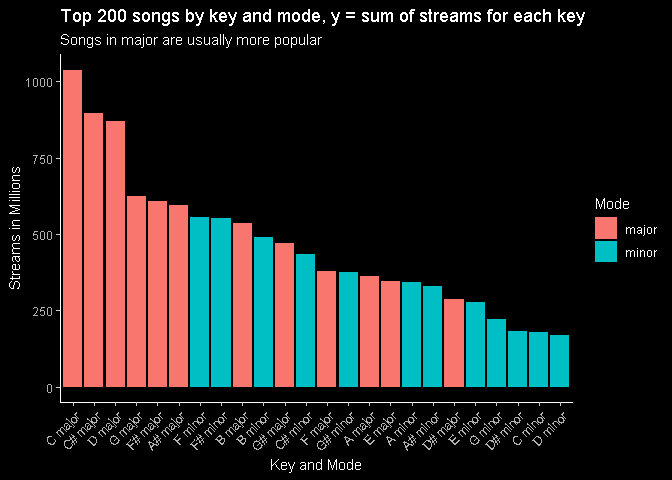
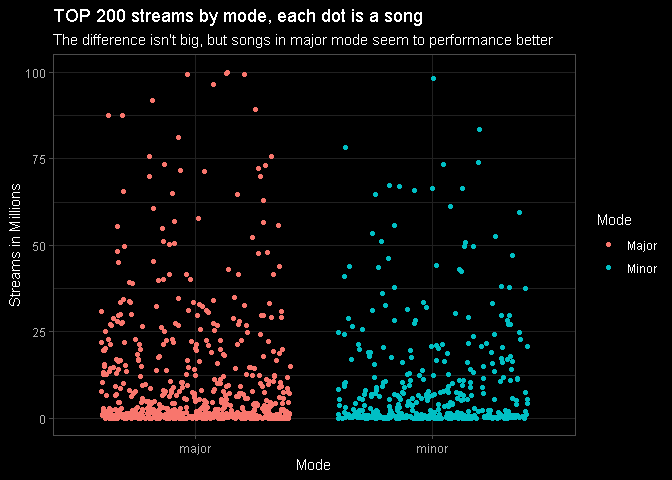

Análise das paradas musicais Top 200 do Spotify para o mercado
brasileiro (Parte 2 - Spotify Objective Analysis)
================
Rodrigo Bercini Martins

### Top 20 músicas por número total de streams em 2019

Primeiro importamos o dataframe criado na seção anterior, o filtramos e
selecionamos as 20 músicas com maior número de streams em 2019.

<details>

<summary>Ver código</summary>

<p>

``` r
# Function to specify decimals
specify_decimal <- function(x, k) trimws(format(round(x, k), nsmall=k))

# Filtering final df for unique songs
top_songs <- df %>%
  group_by(uri, track_name.x) %>%
  summarise(artist=unique(artist_name),
            count= n(),
            total_streams_millions= sum(streams)/1000000) %>%
  arrange(desc(total_streams_millions))

# Top 20 songs in 2019 by total streams
top_20 <- head(top_songs, 20)
top_20$total_streams_millions <- specify_decimal(top_20$total_streams_millions,2)
top_20 <- top_20[,c(2,3,5)]
colnames(top_20) <- c("Track_Name", "Artist", "Total_Streams_Millions")
```

</p>

</details>

``` r
top_20
```

    ## # A tibble: 20 x 3
    ##    Track_Name                                                 Artist              Total_Streams_Millions
    ##    <fct>                                                      <fct>               <chr>                 
    ##  1 Bebi Liguei - Ao Vivo                                      Marília Mendonça    100.03                
    ##  2 Atrasadinha - Ao Vivo                                      Felipe Araújo       99.62                 
    ##  3 Vou Ter Que Superar - Ao Vivo                              Matheus & Kauan     99.48                 
    ##  4 Cobaia                                                     Lauana Prado        99.43                 
    ##  5 Tijolão - Ao Vivo                                          Jorge & Mateus      98.21                 
    ##  6 Todo Mundo Vai Sofrer - Ao Vivo                            Marília Mendonça    96.53                 
    ##  7 Solteiro Não Trai - Ao Vivo                                Gustavo Mioto       91.81                 
    ##  8 Quando a vontade bater (Participação especial de PK Delas) Pk                  89.37                 
    ##  9 Estado Decadente - Acústico                                Zé Neto & Cristiano 87.50                 
    ## 10 Cem Mil - Ao Vivo                                          Gusttavo Lima       87.41                 
    ## 11 Quarta Cadeira - Ao Vivo                                   Matheus & Kauan     83.43                 
    ## 12 Ela É do Tipo                                              MC Kevin o Chris    81.14                 
    ## 13 Evoluiu                                                    MC Kevin o Chris    78.24                 
    ## 14 Ouvi Dizer                                                 Melim               75.75                 
    ## 15 Hoje Eu Vou Parar Na Gaiola                                Mc Livinho          75.57                 
    ## 16 Bebaça - Ao Vivo                                           Marília Mendonça    74.00                 
    ## 17 Espaçosa Demais - Ao Vivo                                  Felipe Araújo       73.28                 
    ## 18 Quem Me Dera                                               Márcia Fellipe      73.26                 
    ## 19 Supera - Ao Vivo                                           Marília Mendonça    73.08                 
    ## 20 Vamos pra Gaiola                                           MC Kevin o Chris    72.31

### Músicas no Top 200 todos os dias do ano

Abaixo podemos conferir as músicas que estiveram no Top 200 das mais
ouvidas todos os 365 dias do ano.

<details>

<summary>Ver código</summary>

<p>

``` r
# Songs that were the entire year (365 days) in the top 200
top_entire_year <- top_songs[top_songs$count == 365,c(2,3,5)]
colnames(top_entire_year) <- c("Track_Name", "Artist", "Total_Streams_Millions")
top_entire_year
```

    ## # A tibble: 13 x 3
    ##    Track_Name                      Artist             Total_Streams_Millions
    ##    <fct>                           <fct>                               <dbl>
    ##  1 Atrasadinha - Ao Vivo           Felipe Araújo                        99.6
    ##  2 Cobaia                          Lauana Prado                         99.4
    ##  3 Solteiro Não Trai - Ao Vivo     Gustavo Mioto                        91.8
    ##  4 Cem Mil - Ao Vivo               Gusttavo Lima                        87.4
    ##  5 Ouvi Dizer                      Melim                                75.8
    ##  6 Hoje Eu Vou Parar Na Gaiola     Mc Livinho                           75.6
    ##  7 Espaçosa Demais - Ao Vivo       Felipe Araújo                        73.3
    ##  8 Poesia Acústica #6: Era uma Vez Pineapple StormTv                    67.3
    ##  9 Meu Abrigo                      Melim                                64.8
    ## 10 Dona de mim                     IZA                                  52.5
    ## 11 Deixa (feat. Ana Gabriela)      Lagum                                52.4
    ## 12 Cidade Vizinha - Ao Vivo        Henrique & Juliano                   49.6
    ## 13 Believer                        Imagine Dragons                      36.0

</p>

</details>

``` r
top_entire_year
```

    ## # A tibble: 13 x 3
    ##    Track_Name                      Artist             Total_Streams_Millions
    ##    <fct>                           <fct>                               <dbl>
    ##  1 Atrasadinha - Ao Vivo           Felipe Araújo                        99.6
    ##  2 Cobaia                          Lauana Prado                         99.4
    ##  3 Solteiro Não Trai - Ao Vivo     Gustavo Mioto                        91.8
    ##  4 Cem Mil - Ao Vivo               Gusttavo Lima                        87.4
    ##  5 Ouvi Dizer                      Melim                                75.8
    ##  6 Hoje Eu Vou Parar Na Gaiola     Mc Livinho                           75.6
    ##  7 Espaçosa Demais - Ao Vivo       Felipe Araújo                        73.3
    ##  8 Poesia Acústica #6: Era uma Vez Pineapple StormTv                    67.3
    ##  9 Meu Abrigo                      Melim                                64.8
    ## 10 Dona de mim                     IZA                                  52.5
    ## 11 Deixa (feat. Ana Gabriela)      Lagum                                52.4
    ## 12 Cidade Vizinha - Ao Vivo        Henrique & Juliano                   49.6
    ## 13 Believer                        Imagine Dragons                      36.0

### Análise de posição

Músicas que estiveram na primeira posição pelo maior número de dias.

<details>

<summary>Ver código</summary>

<p>

``` r
# Songs that were the TOP 1 for most days

top1_songs <- df %>%
  filter(position == 1) %>%
  group_by(uri, track_name.x) %>%
  summarise(artist=unique(artist_name),
            count= n(),
            key_name=unique(key_name),
            mode_name=unique(mode_name),
            duration_ms=unique(duration_ms)) %>%
  arrange(desc(count))

top1_songs <- top1_songs[,2:4]
colnames(top1_songs) <- c('Track_Name', 'Artist', 'Days_as_Top1')
```

</p>

</details>

``` r
top1_songs
```

    ## # A tibble: 17 x 3
    ##    Track_Name                      Artist             Days_as_Top1
    ##    <fct>                           <fct>                     <int>
    ##  1 Todo Mundo Vai Sofrer - Ao Vivo Marília Mendonça             90
    ##  2 Ela É do Tipo                   MC Kevin o Chris             44
    ##  3 Bola Rebola                     Tropkillaz                   36
    ##  4 Surtada - Remix Brega Funk      Dadá Boladão                 35
    ##  5 quando a bad bater - ao vivo    Luan Santana                 35
    ##  6 Atrasadinha - Ao Vivo           Felipe Araújo                31
    ##  7 Liberdade Provisória            Henrique & Juliano           19
    ##  8 Combatchy (feat. MC Rebecca)    Anitta                       18
    ##  9 Jenifer                         Gabriel Diniz                12
    ## 10 Gaiola É o Troco                MC Du Black                  11
    ## 11 Supera - Ao Vivo                Marília Mendonça              7
    ## 12 Terremoto                       Anitta                        7
    ## 13 Hit Contagiante                 Felipe Original               5
    ## 14 quando a bad bater - ao vivo    Luan Santana                  4
    ## 15 Cem Mil - Ao Vivo               Gusttavo Lima                 4
    ## 16 Tijolão - Ao Vivo               Jorge & Mateus                4
    ## 17 Vamos pra Gaiola                MC Kevin o Chris              3

### Análise de tom e modo

Tons e modos mais escutados no Top 200 do Spotify. Músicas em tons
maiores foram mais escutadas.

<details>

<summary>Ver código</summary>

<p>

``` r
# Total streams of Top 200 by key and mode (major or minor)
key <- df %>%
  group_by(uri, track_name.x, key_mode) %>%
  summarise(count= n(),
            total_streams_millions= sum(streams)/1000000,
            key_name=unique(key_name),
            mode_name=unique(mode_name)) %>%
  arrange(desc(total_streams_millions))

key_mode_count <- df %>%
  group_by(key_mode) %>%
  summarise(count = n(),
  total_streams_millions= sum(streams)/1000000,
  mode_name = unique(mode_name))

pl <- ggplot(key_mode_count, aes(x=reorder(key_mode, -total_streams_millions, sum), y=total_streams_millions, fill=mode_name)) +
  geom_col() + dark_theme_classic() +
  theme(axis.text.x = element_text(angle = 45, hjust = 1)) +
  labs(fill = 'Mode', x='Key and Mode', y='Streams in Millions', title='Top 200 songs by key and mode, y = sum of streams for each key', subtitle='Songs in major are usually more popular')
```

    ## Inverted geom defaults of fill and color/colour.
    ## To change them back, use invert_geom_defaults().

</p>

</details>

``` r
pl
```

<!-- -->

O gráfico abaixo mostra que os tons C\#, C e D são majoritariamente
maiores, enquanto F\#, B e F a relação maior/menor é mais equilibrada.

<details>

<summary>Ver código</summary>

<p>

``` r
pl <- ggplot(key, aes(x=reorder(key_name, -total_streams_millions, sum), y=total_streams_millions, fill=mode_name)) +
  geom_col() + labs(fill = 'Mode', x='Key', y='Streams in Millions', title='TOP 200 songs by key and mode', subtitle='C#, C and D are usually major; F#, B and F are 50/50') +
  scale_fill_manual(labels = c("Major", "Minor"), values=c('red','blue')) + dark_theme_minimal() 
```

</p>

</details>

``` r
pl
```

<!-- -->

Considerando cada ponto como uma música, é possível visualizar a
disposição individual de tom vs número de streams.

<details>

<summary>Ver código</summary>

<p>

``` r
pl <- ggplot(key, aes(x=reorder(key_name, -total_streams_millions, sum), y=total_streams_millions, colour=key_name, palette='Set1')) +
  geom_jitter() + dark_theme_minimal() + 
  labs(x='Key', y='Streams in Millions', colour='Key', title='TOP 200 songs by key and streams, each dot represents a song', subtitle='Ordered by overall total streams')
```

</p>

</details>

``` r
pl
```

<!-- -->

Apesar de haverem diversas músicas em tom menor com sucesso, o tom maior
geralmente é mais ouvido.

<details>

<summary>Ver código</summary>

<p>

``` r
pl <- ggplot(key, aes(y=total_streams_millions, x=mode_name, colour= mode_name)) +
  geom_jitter() + dark_theme_light() +
  labs(x='Mode', colour='Mode',
       y='Streams in Millions',
       title='TOP 200 streams by mode, each dot is a song',
       subtitle='The difference isn\'t big, but songs in major mode seem to performance better') +
  scale_color_hue(labels = c("Major", "Minor"))
```

</p>

</details>

``` r
pl
```

<!-- -->

### Duração

Músicas com mais de 6 minutos não costumam entrar no Top 200 diário do
Spotify. As músicas do Top 200 costumam durar entre 100 e 250 segundos.
(1min30s \~ 2min20s).

<details>

<summary>Ver código</summary>

<p>

``` r
length <- df %>%
  group_by(uri,track_name.x) %>%
  summarise(count= n(),
            artist=unique(artist_name),
            total_streams_millions= sum(streams)/1000000,
            length_s=unique(duration_ms)/1000,
            mode_name = unique(mode_name)) %>%
  arrange(desc(length_s))

length$minutes <- (length$length_s %/% 60)
length$seconds <- (length$length_s %% 60)
length$min_sec <- paste(length$minutes, 'min',round(length$seconds),'s')

length_clean <- length[,c(2, 4, 10, 5)]
length_clean$total_streams_millions <- specify_decimal(length$total_streams_millions,2)
colnames(length_clean) <- c('Track_Name', 'Artist', 'Length(s)', 'Total_Streams_Millions')

# Plotting Length vs Total Streams coloured by Mode (major or minor)
pl <- ggplot(length, aes(x=length_s, y=total_streams_millions, colour=mode_name)) +
  geom_point() + dark_theme_gray()+
  scale_x_continuous(breaks = seq(50, 600, 50)) +
  labs(x='Length(sec)', y='Total Streams (Millions)', colour='Mode', title='Songs in TOP 200 are about 100~250 ms long')
```

</p>

</details

```r
# Checking the 20 lenghtiest songs that made in the TOP 200
as.data.frame(head(length_clean,20))
```

```
##                                                                                                  Track_Name            Artist   Length(s) Total_Streams_Millions
## 1                                                                          Poesia Acústica #8: Amor e Samba Pineapple StormTv 10 min 15 s                   3.96
## 2                                                                           Poesia Acústica #6: Era uma Vez Pineapple StormTv  9 min 38 s                  67.33
## 3                                                                                              Venice Bitch      Lana Del Rey  9 min 37 s                   0.09
## 4                                                                              Poesia Acústica #7: Céu Azul Pineapple StormTv  9 min 32 s                  31.09
## 5                                                                                              A Casa É Sua      Casa Worship  9 min 22 s                   9.40
## 6                                                             Poesia Acústica #4: Todo Mundo Odeia Acústico Pineapple StormTv  8 min 25 s                   0.06
## 7                                                                             Poesia Acústica #2: Sobre Nós          Delacruz  7 min 52 s                  17.59
## 8                                                                         Poesia Acústica #3: Capricorniana Pineapple StormTv  7 min 10 s                  18.69
## 9                                                                                         Aquieta Minh'alma    Ministério Zoe   7 min 6 s                   0.12
## 10                                                                                            Lugar Secreto    Gabriela Rocha   7 min 2 s                   0.75
## 11 Pot-Pourri: Escravo do Amor / Tentativas Em Vão / Onde Está Você (Meu Amanhecer) / Menino Bobo - Ao Vivo    Wesley Safadão  6 min 56 s                   0.15
## 12                                                                                          Canção Infantil Pineapple StormTv  6 min 42 s                   0.95
## 13                                                                           DEUS E O DIABO NA TERRA DO SOL            Djonga  6 min 27 s                   0.71
## 14                                                                                               Baila Mais          Orgânico  6 min 26 s                   0.78
## 15                                                                                              God Control           Madonna  6 min 19 s                   0.08
## 16                                                                                                Fine Line      Harry Styles  6 min 18 s                   0.13
## 17                                                                                                      She      Harry Styles   6 min 3 s                   0.16
## 18                                                                                           Irmão DQbrada!        Costa Gold   6 min 1 s                  10.53
## 19                                                                                      Sweet Child O' Mine     Guns N' Roses  5 min 55 s                   0.27
## 20                                                                             Bohemian Rhapsody - 2011 Mix             Queen  5 min 54 s                  21.26
```

```r
pl
```

<!-- -->
